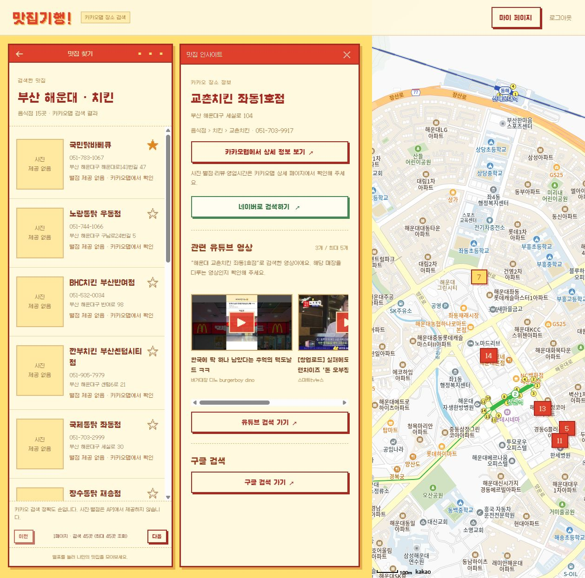
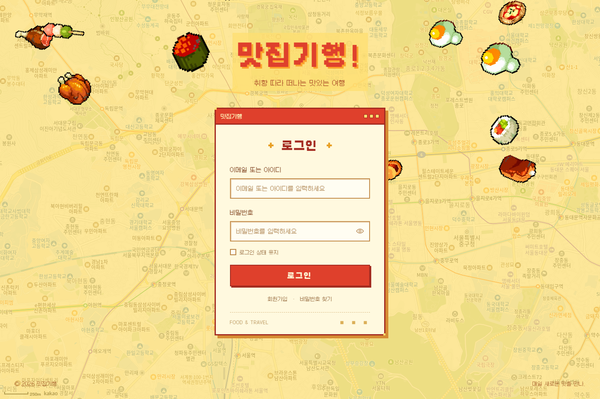
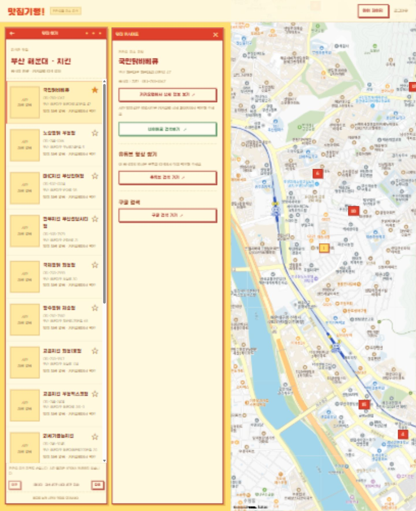
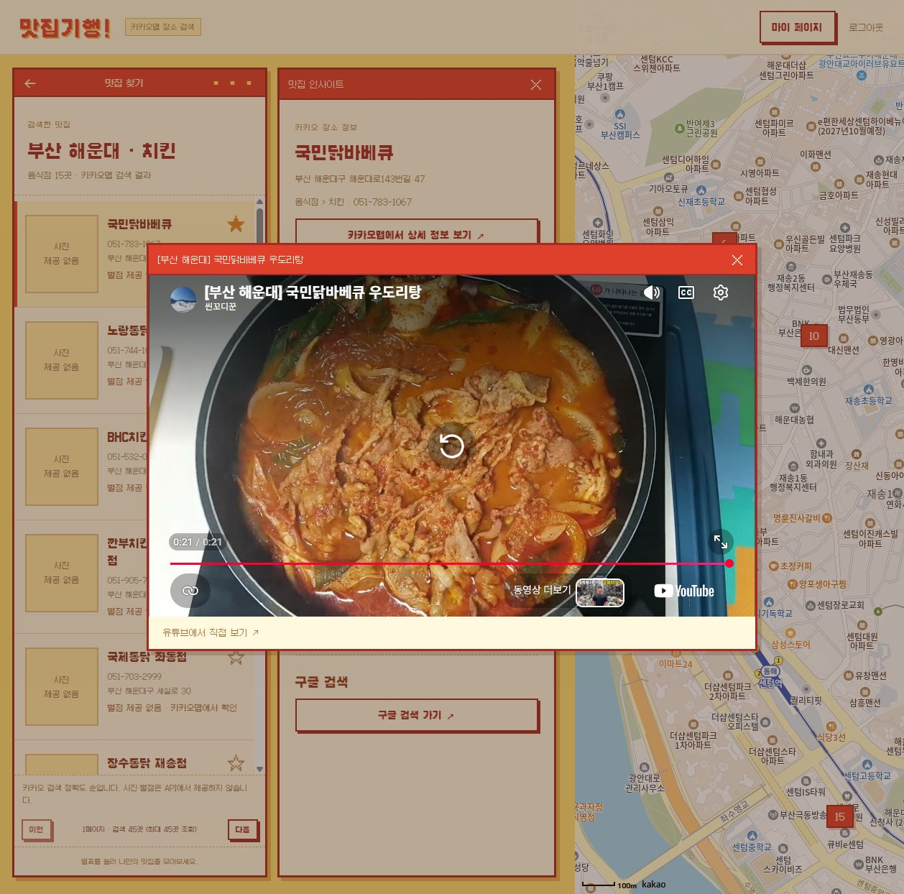
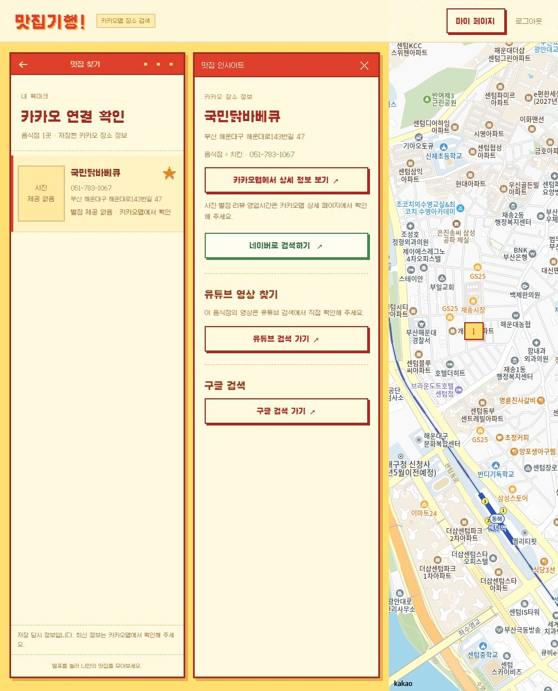
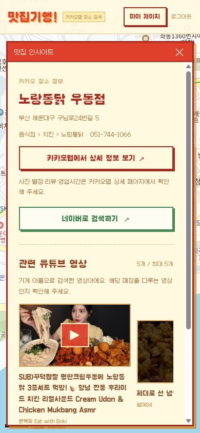

# 🍽️ 맛집기행

> 지역과 메뉴로 실제 음식점을 검색하고, 지도와 관련 영상을 확인한 뒤<br>
> **마음에 드는 음식점을 개인 북마크에 저장하는 웹 기반 맛집 여행 서비스**입니다.

---

## 📌 프로젝트 개요

| 항목 | 내용 |
| --- | --- |
| 프로젝트명 | 맛집기행 |
| 프로젝트 유형 | EnjoyTrip 프론트엔드 실습 프로젝트 |
| 주요 기능 | 음식점 검색, 지도 조회, 맛집 인사이트, 관련 영상, 개인 북마크, 관광정보, 회원 관리 |
| 주요 데이터 | 카카오 장소 정보, YouTube 영상 검색, Google 이미지 검색, 한국관광공사 관광정보 |
| 핵심 기술 | HTML, CSS, JavaScript, ES Modules, Node.js, OpenAPI, localStorage |
| 실행 환경 | Node.js 22 이상 / 최신 웹 브라우저 |

`맛집기행`은 여행 지역에서 먹고 싶은 메뉴를 검색하고, 음식점의 위치와 외부 정보를 비교한 뒤 방문 후보를 저장하는 서비스입니다.

EnjoyTrip의 관광정보 조회와 회원 관리 기능을 바탕으로 다음 기능을 구현했습니다.

- 지역·메뉴 기반 실제 음식점 검색
- 음식점 목록과 지도 핀 연결
- 카카오맵 상세정보 및 네이버·구글·유튜브 검색 링크
- 관련 유튜브 영상 조회와 앱 내 재생
- 회원별 북마크 그룹 생성 및 음식점 저장·해제
- 검색 화면과 저장한 음식점의 새로고침 복원
- PC·모바일 반응형 화면

---

## 🖥️ 프로젝트 실행 화면

PC 화면에서는 음식점 목록, 선택한 음식점의 인사이트, 지도를 함께 표시합니다.

- 왼쪽: 검색 조건, 음식점 목록, 북마크 버튼, 페이지 이동
- 가운데: 선택한 음식점 정보, 외부 검색 링크, 관련 유튜브 영상
- 오른쪽: 검색 결과의 지도 위치와 음식점 핀



---

## ✨ 주요 기능

### 1. 회원가입 및 로그인

아이디 또는 이메일로 로그인할 수 있으며, 회원정보 수정·탈퇴·비밀번호 재설정 기능을 제공합니다.

**구현 내용**

- 회원가입 입력값 및 아이디·이메일 중복 검증
- salt와 PBKDF2-SHA-256을 이용한 비밀번호 해시 저장
- 로그인 유지 선택 시 30일, 미선택 시 12시간의 세션 유효기간 적용
- 화면 이동·새로고침 시 세션 만료 확인
- 회원정보 수정 및 북마크 접근 전 비밀번호 재확인
- 로컬 계정 비밀번호 재설정 데모

**관련 Source**

- [js/auth.js](js/auth.js)
- [js/main.js](js/main.js)
- [js/storage.js](js/storage.js)



### 2. 지역·메뉴 기반 음식점 검색

지역을 입력하고 메뉴를 선택적으로 추가하면 카카오 장소 검색을 통해 실제 음식점을 조회합니다.

**구현 내용**

- 지역 필수 입력, 메뉴 미입력 시 지역의 음식점 검색
- 카카오 `services.Places.keywordSearch` 사용
- 음식점 카테고리 `FD6`으로 결과 제한
- 페이지당 15곳, 최대 3페이지·45곳 조회
- 장소 ID 기준 중복 제거 및 좌표 유효성 검증
- 검색어·페이지 상태 저장과 새로고침 시 재조회
- 로딩·빈 결과·오류 안내 및 재시도

**관련 Source**

- [js/restaurant-api.js](js/restaurant-api.js)
- [js/restaurant-app.js](js/restaurant-app.js)
- [js/restaurant-store.js](js/restaurant-store.js)



### 3. 음식점 정보와 지도 연동

음식점 목록 또는 지도 핀을 선택하면 해당 장소의 정보를 확인할 수 있습니다. 선택한 음식점은 인사이트 패널에 표시하며 검색 목록은 유지합니다.

**표시 정보**

- 음식점 이름, 주소, 전화번호, 카테고리
- 위도·경도에 따른 지도 위치
- 카카오맵 장소 상세 링크
- 전화번호가 없는 장소의 미등록 안내

**구현 내용**

- 검색 결과의 좌표를 지도 핀에 반영
- 목록·지도 핀 선택과 인사이트 패널 연결
- 지도 SDK 로더 공유
- 장소 상세 페이지에서 리뷰·영업시간 등 추가 정보 확인

**관련 Source**

- [js/kakao-sdk.js](js/kakao-sdk.js)
- [js/restaurant-api.js](js/restaurant-api.js)
- [js/restaurant-app.js](js/restaurant-app.js)

### 4. 맛집 인사이트 및 외부 검색

선택한 음식점의 카카오맵 상세 페이지와 네이버·유튜브·구글 검색으로 연결합니다.

**구현 내용**

- 카카오 장소 ID에 대응하는 상세 페이지 연결
- 지역명과 가게 이름으로 외부 검색어 구성
- 도로명·번지를 제외한 검색어 사용
- 북마크로 다시 연 음식점에도 동일한 검색어 구성 적용
- 외부 검색 링크는 API 키 없이 사용

**관련 Source**

- [js/restaurant-search.js](js/restaurant-search.js)
- [js/restaurant-app.js](js/restaurant-app.js)

### 5. 유튜브 영상 조회 및 재생

지역명과 가게 이름으로 검색한 실제 영상의 썸네일·제목·채널을 표시합니다. 영상 카드를 누르면 앱 안에서 재생창이 열립니다.

**구현 내용**

- YouTube Data API v3를 서버에서 호출
- 임베드 가능한 영상 최대 5개 조회
- 영상 목록 가로 스크롤 제공
- 동일 검색의 동시 요청 공유 및 결과 1시간 메모리 캐시
- 음식점 변경 시 이전 요청 취소 및 늦은 응답 반영 방지
- 창 닫기·음식점 변경·화면 이동 시 플레이어 해제
- 로딩·빈 결과·오류·다시 검색 안내

**관련 Source**

- [js/youtube-api.js](js/youtube-api.js)
- [server/youtube.js](server/youtube.js)
- [js/restaurant-app.js](js/restaurant-app.js)



### 6. 개인 북마크 저장 및 재조회

음식점의 별표 버튼을 눌러 원하는 북마크 그룹에 저장합니다. 다른 지역을 검색한 뒤에도 마이페이지에서 저장한 음식점을 다시 확인할 수 있습니다.

**구현 내용**

- 회원별 북마크 분리
- 북마크 그룹 이름 1~40자 및 중복 검증
- 하나의 음식점을 여러 그룹에 저장·해제
- 같은 그룹에 음식점 중복 저장 방지
- 카카오 장소 ID 기준으로 검색한 장소 정보를 누적 저장
- 저장한 음식점의 상세정보와 지도 위치 재조회
- 회원 탈퇴 시 해당 회원의 북마크 삭제

**관련 Source**

- [js/restaurant-store.js](js/restaurant-store.js)
- [js/restaurant-app.js](js/restaurant-app.js)
- [js/auth.js](js/auth.js)



### 7. 음식점 이미지 검색

음식점 카드의 썸네일 영역과 `사진 제공 없음` 표시는 제거했습니다. 목록은 이름·전화번호·주소·별점 안내를 표시하며 이미지 검색을 요청하지 않습니다. 아래 이미지 검색 모듈은 이전 구현으로 보관되어 있으며 현재 화면에서는 사용하지 않습니다.

**구현 내용**

- 서버에서 이미지 검색 API 호출 및 키 관리
- 첫 이미지 검색 결과 사용, `검색 이미지` 표시
- 화면에 들어온 카드만 요청하며 동시 요청은 최대 2건으로 제한
- 검색 결과 24시간 메모리 캐시
- 목록·화면 변경 시 요청 취소
- 설정 누락·빈 결과·이미지 로드 실패 시 `제공 없음` 표시

**관련 Source**

- [js/restaurant-images.js](js/restaurant-images.js)
- [server/restaurant-images.js](server/restaurant-images.js)

### 8. 지역별 관광정보 조회

관광정보 화면에서 시도·시군구·콘텐츠 유형을 선택해 목록과 상세정보를 조회합니다.

**구현 내용**

- 관광지·숙박·음식점 조회
- 문화시설·행사·여행코스·쇼핑·레포츠 조회
- 지역 및 키워드 검색, 페이지 이동, 상세정보 조회
- 한국관광공사 TourAPI `KorService2` 서버 중계
- 실제 API 모드와 샘플 모드 선택
- 실제 모드 오류 시 안내 표시 및 샘플 자동 대체 없음

**관련 Source**

- [js/api.js](js/api.js)
- [js/main.js](js/main.js)
- [js/data.js](js/data.js)
- [js/map.js](js/map.js)
- [server/tour.js](server/tour.js)

---

## 🎨 UI 구성

노랑·빨강 색상과 픽셀 그래픽을 사용해 음식 여행 서비스의 화면을 구성했습니다.

- Galmuri11 로컬 폰트와 픽셀 테두리 적용
- 로그인 화면의 지도 배경 및 드래그 가능한 음식 그래픽
- PC의 목록·인사이트·지도 동시 표시
- 모바일 화면에 맞춘 정보 패널과 영상 카드 가로 스크롤
- 비밀번호 확인·북마크 이름 입력·영상 재생을 화면 내 대화상자로 제공
- 검색·영상 조회의 로딩, 빈 결과, 오류 상태 구분



---

## 🏗️ 시스템 구조

```text
브라우저 (HTML / CSS / JavaScript)
  │
  ├─ 회원·세션·북마크 ────────── localStorage
  │
  ├─ 음식점 검색·지도 ────────── Kakao Maps SDK + Places
  │
  └─ 영상·이미지·관광정보 요청
          │
          ▼
     Node.js 서버 (server.mjs)
          │
          ├─ server/youtube.js ─────────── YouTube Data API v3
          ├─ server/restaurant-images.js ─ Google Custom Search JSON API
          └─ server/tour.js ────────────── 한국관광공사 TourAPI
```

카카오 JavaScript 키는 지도 SDK 실행을 위해 브라우저에 전달합니다. 유튜브·Google 이미지·관광정보 서비스 키는 서버에서만 사용하며, 환경변수 파일과 서버 소스는 정적 제공 대상에서 제외합니다.

---

## 📂 프로젝트 구조

```text
EnjoyTrip_FrontEnd/
├── index.html                 # 화면과 대화상자
├── css/                       # 공통·로그인·음식점 화면 스타일
├── js/
│   ├── main.js                # 화면 이동, 회원·관광정보 UI
│   ├── auth.js                # 로컬 회원·세션·비밀번호 확인
│   ├── login-scene.js         # 음식 픽셀 배경
│   ├── restaurant-app.js      # 검색·지도·인사이트·북마크 UI
│   ├── restaurant-api.js      # 카카오 장소 검색·응답 정규화
│   ├── restaurant-store.js    # 장소 카탈로그·회원별 북마크
│   ├── restaurant-search.js   # 지역·가게 이름 검색어 구성
│   ├── restaurant-images.js   # 이미지 요청·화면 표시
│   ├── youtube-api.js         # 영상 검색 요청
│   └── kakao-sdk.js           # 지도 SDK 공유 로더
├── server.mjs                 # 정적 서버·API 라우팅
├── server/
│   ├── tour.js                # 관광정보 API 중계
│   ├── youtube.js             # 영상 검색·캐시
│   └── restaurant-images.js   # 이미지 검색·캐시
├── tests/                     # 자동 검사
├── docs/                      # 기획·화면·테스트 문서와 캡처
├── resources/                 # 이미지·폰트
├── 01_api/                    # 기존 API 참고 자료
├── board/                     # 이야기 게시판 목록·상세·작성·수정
└── .env.example               # 환경변수 예제
```

`board/`는 맛집기행의 픽셀 스타일을 적용한 이야기 게시판입니다. 맛집 검색 화면의 게시판 메뉴 또는 `/board/list.html`에서 열 수 있습니다. 기존 `boards` localStorage 데이터를 유지하며, 글 작성·조회·수정·삭제, 검색과 페이지 이동을 제공합니다. 게시글은 같은 브라우저·접속 주소에만 저장되며 서버 공유나 작성자 권한 검사는 제공하지 않습니다.
---

## 🔄 서비스 동작 흐름

```text
회원가입 및 로그인
    ↓
지역·메뉴 입력
    ↓
카카오 음식점 검색
    ↓
음식점 목록과 지도 핀 표시
    ↓
목록 또는 지도에서 음식점 선택
    ↓
장소 정보·외부 검색·관련 영상 확인
    ↓
북마크 그룹에 저장
    ↓
마이페이지 비밀번호 확인
    ↓
저장한 음식점 재조회
```

| 화면 | 주소 |
| --- | --- |
| 로그인 | `/#login` |
| 회원가입 | `/#join` |
| 비밀번호 재설정 | `/#reset` |
| 지역·메뉴 검색 | `/#home` |
| 음식점 목록·인사이트 | `/#results` |
| 내 북마크 | `/#bookmarks` |
| 회원정보 수정 | `/#profile` |
| 관광정보 조회 | `/#tour` |
| 이야기 게시판 | `/board/list.html` |
| 게시글 작성·상세·수정 | `/board/write.html`, `/board/view.html?index=글번호`, `/board/modify.html?index=글번호` |

---

## 📋 기능 구현 현황

| 구분 | 기능 | 구현 내용 |
| --- | --- | --- |
| 관광정보 | 지역·유형별 조회 | 시도·시군구, 콘텐츠 유형, 키워드, 목록·상세 조회 |
| 회원 관리 | 가입·조회·수정·탈퇴 | 입력 검증, 중복 확인, 로컬 회원정보 저장 |
| 로그인 관리 | 로그인·로그아웃·비밀번호 재설정 | 비밀번호 해시 검증, 세션 만료, 재설정 데모 |
| 음식점 검색 | 지역·메뉴 검색 | 실제 카카오 장소 검색, 음식점 카테고리, 페이지 이동 |
| 지도 | 음식점 위치 조회 | 목록과 지도 핀 연결, 선택한 장소 정보 표시 |
| 인사이트 | 외부 정보 확인 | 카카오맵 상세 및 네이버·유튜브·구글 검색 링크 |
| 영상 | 관련 영상 조회·재생 | YouTube 검색, 영상 카드, 재생 대화상자 |
| 북마크 | 회원별 저장·재조회 | 그룹 생성, 다중 그룹 저장·해제, 비밀번호 재확인 |
| 이미지 | 음식점 검색 이미지 | Google 이미지 첫 결과 표시, API 설정 필요 |
| 반응형 UI | PC·모바일 화면 | 화면 크기에 따른 목록·인사이트·영상 배치 |

---

## ⚙️ 기술 스택

| 구분 | 기술 |
| --- | --- |
| Language & UI | HTML5, CSS3, Vanilla JavaScript, ES Modules |
| Server | Node.js 22 이상, 기본 `http` 모듈 |
| Data & State | JSON, localStorage, 카카오 장소 ID 기반 카탈로그 |
| Network | Fetch API, AbortController, Kakao Maps JavaScript SDK, OpenAPI |
| Design | Galmuri11, 픽셀 그래픽, 반응형 CSS |
| Test | Node.js 기본 테스트 러너 |

별도 프레임워크나 추가 npm 패키지 없이 실행할 수 있습니다.

---

## 🌐 사용 API 및 설정

음식점 검색과 지도는 카카오 SDK를 사용한다. 영상·이미지 검색과 관광정보 실제 조회는 서버에서 외부 API를 호출한다. 각 기능을 실행하려면 아래 환경변수를 설정해야 한다. 서버용 API 키는 `.env.example`을 복사한 `.env`에 입력합니다.

| API | 필수 여부 | 필요한 값 | 미설정 시 |
| --- | --- | --- | --- |
| Kakao Maps JavaScript SDK + Places | 음식점 검색·지도에 필수 | `KAKAO_MAP_JS_KEY` | 코드의 기본 JavaScript 키를 사용한다. 해당 앱의 도메인·권한에 따라 동작 여부가 달라진다. |
| YouTube Data API v3 | 앱 내 영상 검색에 필요, 선택 기능 | `YOUTUBE_API_KEY` | 영상 검색 오류 안내가 표시된다. 외부 유튜브 검색 링크는 사용할 수 있다. |
| Google Custom Search JSON API | 이전 이미지 검색 모듈용, 현재 화면에서 사용하지 않음 | `GOOGLE_CUSTOM_SEARCH_API_KEY`, `GOOGLE_CUSTOM_SEARCH_CX` | 현재 음식점 목록에는 사진 영역이 없다. |
| 한국관광공사 TourAPI | 관광정보 실제 모드에 필요, 선택 기능 | `TOUR_API_SERVICE_KEY` | 실제 조회는 사용할 수 없고 샘플 모드는 사용할 수 있다. |

카카오 기본 키는 `js/map-config.js`에 있다. 자신의 카카오 앱 JavaScript 키를 `.env`에 설정해 사용하는 것을 권장한다. 음식점 검색에 별도 Kakao REST 키는 필요하지 않다.

유튜브는 Google Cloud 프로젝트에서 **YouTube Data API v3를 활성화하고 API 키를 발급**하면 된다. 현재 공개 영상 검색에는 OAuth 로그인 설정이 필요하지 않다. [YouTube 공식 설정 안내](https://developers.google.com/youtube/v3/getting-started)

Google Custom Search JSON API는 **신규 고객에게 제공되지 않으며, 기존 고객도 2027-01-01까지 대체 서비스로 전환해야 한다.** 기존 이용 권한이 없다면 키 발급만으로 사진 기능을 켤 수 없다. 사진 기능을 계속 제공하려면 다른 이미지 공급 방식으로 코드를 변경해야 한다. [Google 공식 안내](https://developers.google.com/custom-search/v1/overview)

네이버·구글·유튜브의 **외부 검색 링크**에는 API 키가 필요하지 않다. 회원가입·로그인·북마크도 로컬 저장 방식이므로 별도 인증 API나 DB 설정은 필요하지 않다.

## ▶️ 실행 방법

### 1. 환경변수 준비

Node.js 22 이상을 준비한 뒤 프로젝트 폴더에서 실행한다. 기존 `.env`가 있다면 필요한 값만 수정한다.

```powershell
Copy-Item .env.example .env
```

| 변수 | 용도 | 필요한 기능 |
| --- | --- | --- |
| `PORT` | 서버 포트. 예제 값은 `5179` | 서버 실행 |
| `KAKAO_MAP_JS_KEY` | 카카오 앱의 JavaScript 키 | 지도·음식점 검색 |
| `YOUTUBE_API_KEY` | YouTube Data API v3 키 | 관련 영상 검색 |
| `GOOGLE_CUSTOM_SEARCH_API_KEY` | Google Custom Search API 키 | 음식점 이미지 검색 |
| `GOOGLE_CUSTOM_SEARCH_CX` | 이미지 검색을 켠 검색엔진 ID | 음식점 이미지 검색 |
| `TOUR_API_SERVICE_KEY` | 공공데이터포털 관광정보 서비스 키 | 관광정보 실제 모드 |

카카오 키는 브라우저에서 사용하는 **JavaScript 키**다. REST API 키나 Admin 키를 넣지 않는다. 나머지 서비스 키는 서버에서만 사용한다. `.env`는 커밋하지 않는다.

### 2. 카카오 도메인 등록

카카오 앱의 JavaScript SDK 도메인에 `http://127.0.0.1:5179`를 등록하고 지도 API 이용 권한을 확인한다. 브라우저 접속 주소와 등록한 도메인이 같아야 한다. `localhost`를 사용한다면 해당 주소도 등록한다.

유튜브 영상 검색을 사용하려면 Google Cloud에서 YouTube Data API v3를 활성화한다. 서버가 호출하므로 키 제한도 서버 환경에 맞춰 설정한다. 관광정보 키는 국문 관광정보 서비스_GW 승인 키를 사용하며 Decoding 키를 권장한다.

### 3. 서버 실행

```powershell
npm start -- --port=5179
```

[http://127.0.0.1:5179/](http://127.0.0.1:5179/)에 접속한다. HTML 파일을 직접 열거나 Live Server로 실행하면 서버 API 중계를 사용할 수 없으므로 프로젝트 서버를 이용한다.

```powershell
# 파일 변경 시 서버 자동 재시작
npm run dev -- --port=5179
```

포트를 생략하면 `.env`의 `PORT`를 사용하고, 설정이 없으면 `5173`으로 실행한다. 환경변수를 수정한 뒤에는 서버를 다시 시작한다.

공개 웹 배포는 [Render 배포 가이드](docs/DEPLOYMENT.md)를 따른다. 저장소 루트의 `render.yaml`에는 Node.js 버전, 외부 접속 주소, 테스트 후 실행, `/healthz` 상태 확인 설정이 포함되어 있다.
---

## 🧩 핵심 모듈

| 모듈 | 역할 |
| --- | --- |
| `main.js` | 화면 이동, 회원·관광정보 이벤트 처리 |
| `auth.js` | 로컬 회원 관리, 비밀번호 해시, 세션, 비밀번호 재확인 |
| `restaurant-app.js` | 음식점 검색·지도·인사이트·북마크 화면 제어 |
| `restaurant-api.js` | 카카오 장소 검색 및 응답 정규화 |
| `restaurant-store.js` | 장소 카탈로그, 검색 상태, 회원별 북마크 저장 |
| `restaurant-search.js` | 지역명·가게 이름 기반 검색어 구성 |
| `restaurant-images.js` | 화면에 보이는 음식점 카드의 이미지 요청 |
| `kakao-sdk.js` | 지도 SDK 로딩 및 공유 |
| `server.mjs` | 정적 파일 제공, 환경설정 응답, API 라우팅 |
| `server/youtube.js` | 영상 검색, 오류 처리, 요청 공유 및 캐시 |
| `server/restaurant-images.js` | 이미지 검색, 오류 처리 및 캐시 |
| `server/tour.js` | 관광 API 요청과 응답·오류 처리 |

---

## 💡 구현 시 고려한 문제

### 1. 검색 변경 후 이전 응답이 표시되는 문제

비동기 조회 중 음식점이나 화면을 바꾸면 이전 요청이 늦게 도착할 수 있습니다. 요청 취소와 요청 순서·현재 화면·회원 상태 확인을 적용해 이전 응답이 새 화면을 덮어쓰지 않도록 처리했습니다.

### 2. 다른 지역 검색 후 북마크 정보 유지

새 검색 결과로 기존 장소 정보를 교체하면 저장한 음식점을 다시 열 수 없습니다. 장소 정보를 카카오 장소 ID 기준으로 누적 저장하고 북마크에서 해당 정보를 참조하도록 구성했습니다.

### 3. 외부 API 요청 중복과 사용량

동일한 영상·이미지 검색 요청은 서버에서 공유하고 결과를 메모리에 캐시합니다. 이미지는 보이는 카드만 조회하고 동시 요청 수를 제한합니다. 실패 응답은 캐시하지 않아 재시도할 수 있습니다.

### 4. 제공되지 않는 음식점 정보

카카오 장소 검색은 사진·별점·리뷰·영업시간을 제공하지 않습니다. 음식점 사진 영역은 제거했으며 별점은 제공 없음으로 표시하고 상세 페이지로 연결합니다. 영상은 별도 검색 결과로 표시합니다.

### 5. 회원별 데이터와 마이페이지 접근

북마크를 회원별로 분리하고, 마이페이지와 회원정보 수정은 비밀번호 재확인을 거치도록 구성했습니다. 비밀번호 변경·재로그인·세션 만료 후에는 다시 확인해야 합니다.

---

## 🧪 테스트

```powershell
npm test
```

| 테스트 파일 | 검사 대상 |
| --- | --- |
| `base.test.js` | 회원 흐름, 세션, 관광 샘플 필터, 서버 정적 제공 |
| `board.test.js` | 기존 게시글 보존, 작성·조회·수정·삭제, 입력·저장소 오류, 게시판 정적 제공 |
| `deployment.test.js` | 실제 서버 실행의 HOST·PORT 적용, 상태 확인, 화면 제공·비밀 파일 차단 |
| `restaurant-flow.test.js` | 음식점 검색·페이지 처리, 장소 저장, 북마크 분리, 비밀번호 재확인 |
| `tour-api.test.js` | 관광 API 요청 파라미터와 인증·네트워크 오류 |
| `youtube-api.test.js` | 영상 검색, 응답 정규화, 요청 공유, 캐시, 키 비노출 |
| `restaurant-images.test.js` | 이미지 첫 결과, 설정·응답 오류, 캐시, 키 비노출 |

실제 연동은 API 키를 설정한 뒤 지역·메뉴 검색, 영상 재생, 북마크 저장·재조회, 관광정보 실제 모드를 통해 확인할 수 있습니다.

---

## ⚠️ 현재 제한 사항

- 회원·세션·북마크는 localStorage에 저장되어 같은 브라우저와 접속 주소에서만 유지됩니다. 기기·브라우저·포트 간 동기화는 제공하지 않습니다.
- 회원 인증 서버·DB·메일 발송·본인 인증은 구현하지 않았으며, 비밀번호 재설정은 로컬 계정 데모입니다.
- 음식점 결과는 카카오 검색 정확도 순이며, 별점·리뷰 기반 추천 순위가 아닙니다. 지역 검색어가 행정구역 경계를 엄격하게 제한하지는 않습니다.
- 북마크는 저장 당시 음식점 정보입니다. 최신 정보는 카카오맵 상세 페이지에서 확인해야 합니다.
- 이미지·영상 검색 결과가 해당 매장의 공식 사진이나 방문 영상임을 보장하지 않습니다.
- 외부 API 이용에는 키·권한·도메인 설정이 필요하며, 요청 한도와 제공자 상태에 따라 조회가 제한될 수 있습니다.
- 자연어·AI 추천, 리뷰 수집·요약, 여행 경로 생성·편집·저장은 구현 범위에 포함하지 않습니다.

---

## 🚀 향후 개선사항

- 서버 기반 회원 인증과 DB 저장
- 기기 간 북마크 동기화
- 이용 가능한 이미지 제공 방식으로 전환
- 자연어 여행 조건 입력과 실제 음식점 데이터 기반 추천
- 선택한 음식점의 방문 순서 편집 및 여행 경로 저장
